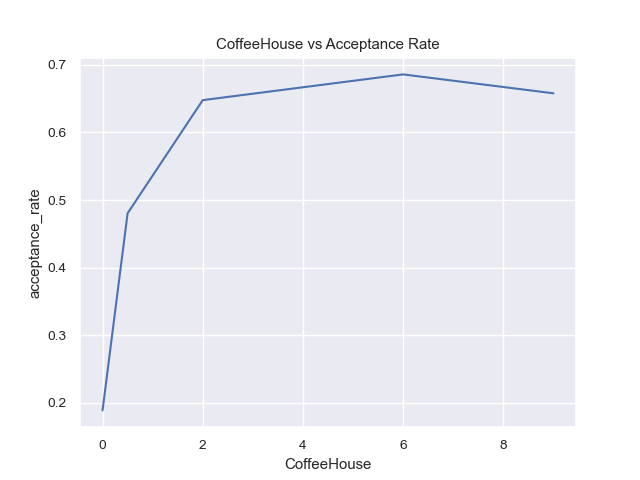
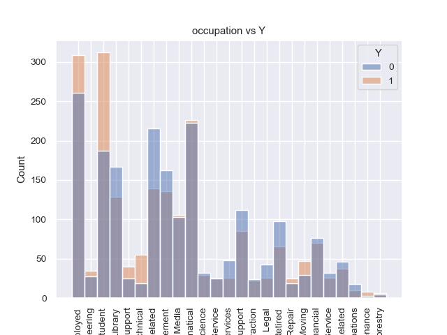
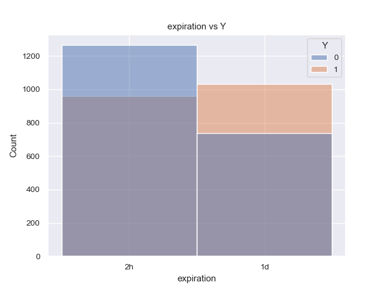
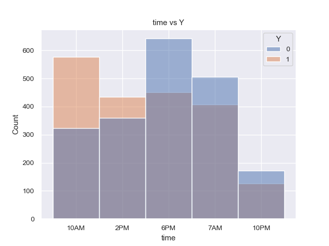

# Will a Customer Accept the Coupon?

## Executive Summary

- Completed EDA tasks on coupon dataset.
- Analyzed the `Bar` coupon category and calculated joint probability distributions.
- Analyzed the `Coffee House` coupon category and discovered that  
    - `CoffeeHouse` (how many times a customer visited a coffee house in the last month) is the major factor contributing to coupon acceptance rate.
    - Other factors like `occupation`, `expiration` show a relatively strong relationship to the coupon acceptance.

## [EDA Task list](https://docs.google.com/presentation/d/1NcE16zpb0ZA_EO29bKEebgm2ki6z_ne06_dqOdMybos/edit#slide=id.p1)

### 1. Preliminary Data Review

- [x] Review Row and Column Count
- rows: 12684, columns: 26
- This dataset is in `long` format rather than `wide` format.

- [x] How many categorical and numerical columns?
- categorical columns: 8 , numerical columns: 18

- [x] How many dummy columns (boolean values: yes/no, or integer values: 1/0)
- 8 columns with 1/0 integers

- [x] Are the date column(s) read in the right format?
- This dataset has no date/timestamp type

- [x] Are the categorical/numerical columns read in the right format?
- Yes

- [x] Are there any duplicates in the data?
- There are a total of 74 duplicate rows in the entire row, or the duplicate rate is 0.58%. 
- The decision is to keep the duplicates.
    - The duplicate rate is low.
    - There is no unique identifier such as 'survey_id' in the original csv file.
    - This dataset is in a `long` format. It is highly possible to have rows with the same data but those rows were collected from different individuals.

### 2. Missing Values

- [x] How many missing values are there? Do any variables have mostly or all missing values?
- Column `car` has the highest missing data rate of 99.14% than other columns. This column is so sparse that it offers little information in terms of the entire rows.
- Other categorical columns (e.g., `Bar`, `CoffeeHouse`, `CarryAway`, `RestaurantLessThan201`, `Restaurant20To50`) have the lower missing data rates varying from 1% to 2%.

- [x] Are you going to impute the missing value or drop them?
- The decision is to drop column `car` for further processing.

- [x] How would you impute the missing values in numerical vs categorical variables?
- The decision is to use the first one from `mode` values (the most frequent values) in the same column to fill in the missing data.

### 3. Review Outliers

- [x] Are there strange minimum or maximum values (outliers)?
- No. Numeric columns are just 0/1 value.
- For easy query in the later tasks, categorical columns (`Bar`, `CoffeeHouse`, `CarryAway`, `RestaurantLessThan20`, `Restaurant20To50`), `age` and `income` values have been re-mapped into integers with their meaningful rank order unchanged. Choosing a clever mapping with capped value can avoid that outlier problem: for example, `Bar`'s `'gt8'` -> int `9` and `income`'s `'$100000 or More'` -> int `100_001`.

- [x] Are there strange mean values or large differences between mean and median?
- No. Numeric columns are just 0/1 value.

- [x] Is there a large skew or excess kurtosis? (This matters for algorithms that assume normal distributions in the data.)
- `toCoupon_GEQ5min` is always 1 for all rows. The constant value makes this column useless.
- `age` and `income` have been converted into integer values during the analysis. Their original cardinal numbers are less than 10. The task of visualizing histograms and identifying distribution patterns becomes very challenging due to the low cardinality.
    - [ ] TODO: Confirm `age` is normal distributed, and
    - [ ] TODO: Confirm `income` is **skewed right distribution**.

- [ ] Are there gaps in the distributions, such as bi-modal or multi-modal distributions? 
- TODO: Need a program or library to detect those bi-modal or multi-modal distributions: https://en.wikipedia.org/wiki/Multimodal_distribution

### 4. Review Categorical Variables

- [x] Are there any values in the categorical variables that don’t match the dictionary of valid values?
- No

- [x] Are there any high-cardinality categorical variables? [That is categorical values with too many categories]
- `occupation` has the highest cardinal number of 25. The cardinal number from other columns are below 10.

- [x] Are there any categorical variables with large percentages of records having a single value?
- `direction_same`, `direction_opp`, `weather`, and `toCoupon_GEQ25min`: the relative frequency of the most frequent value is 78% ~ 89%.
- `toCoupon_GEQ5min` is 100% with integer value of `1`.

### 5. Find Relationships

- [x] Are there any unusually strong relationships with the target variable, possibly indicating leakage of the target into a candidate input variable?
- `direction_same` and `direction_opp` are mutually exclusive 0/1 values.

- [x] Are any variables highly correlated with each other, possibly indicating redundant variables? 
- [ ] Multicollinearity is a problem for linear models like linear regression
- N/A

- [x] Are there any crosstabs that show strong relationships between categorical variables, possibly indicating redundant variables?
- Performed `chi-square` test for each pair of categorical variables. There are a lot of noises in the output. The key to success is selecting a good `p` threshold value.

### 6. Additional EDA Tasks completed
- [x] Fixed the column name spelling error in column `passanger`, renamed it `passenger`.

## `Coffee House` Coupon Findings

### `CoffeeHouse`

`CoffeeHouse` is the major factor contributing to the coupon acceptance rate.

The figure below illustrates the acceptance rate for various bins of `CoffeeHouse`. It is obvious that if a customer goes to a coffee house more often, he/she will be more likely to accept the `Coffee House` coupon. 

### `occupation`

`occupation` shows a relatively strong relationship to  coupon acceptance.
- `Student` and `Unemployed` groups have a higher acceptance rate than others in the `occupation` column.
- One of the common shared attributes between those two groups might be the lower range of their disposable income to spend on coffee.
- To validate this hypothesis, we could collect some data points like cash/checking account balance in future surveys.

### `expiration`

Longer `expiration` of coupons (1 day) seems to have a higher acceptance rate. It might be the reason that people don't like the idea of changing their current plan in a rush - go to a coffee shop within 2 hours.

### `time`

It is clear that a `Coffee House` coupon in the morning (10 AM) is a nice gift people would like to accept.

## Notebook

[prompt.ipynb](./prompt.ipynb)

